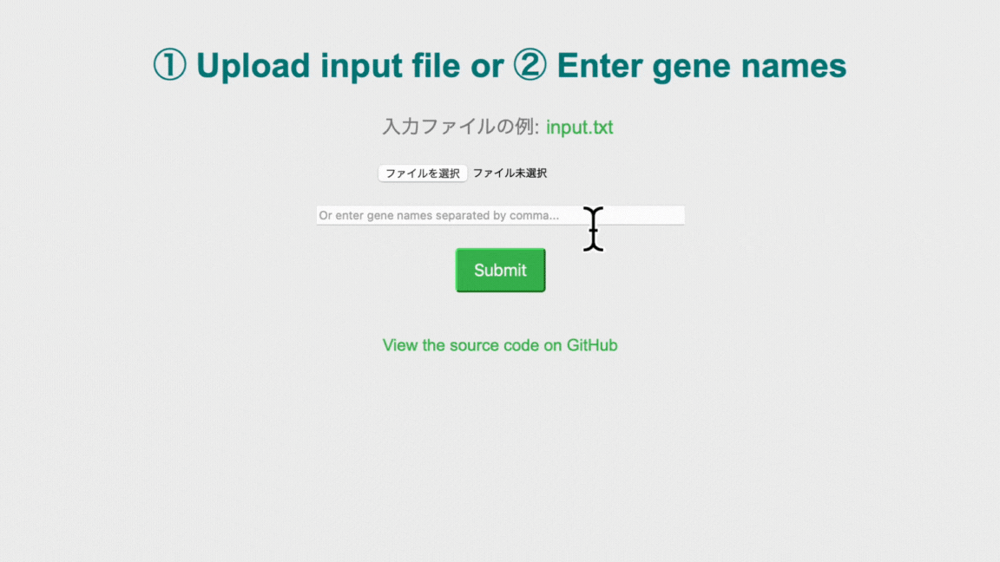

# flask-scrna-spermatogenesis
`flask-scrna-spermatogenesis` is a web application designed to visualize single-cell RNA sequencing (scRNA-seq) datasets, specifically focusing on gene expression during spermatogenesis.

<br>

## Features
- Upload your own gene list from a file
- Enter gene names directly
- Visualize gene expression dynamics across different stages of spermatogenesis

<br>



<br>

## Set up locally

Follow these steps to run the app locally.

1. Create a virtual environment:

    ```bash
    python3 -m venv venv
    source venv/bin/activate
    ```

2. Upgrade pip and install necessary packages:

    ```bash
    python3 -m pip install --upgrade pip
    pip install flask pandas matplotlib seaborn scipy
    ```

3. Run the app:

    ```bash
    # python app.py
    ```

4. If you are running on a CentOS server, you might need to allow traffic on port 5000:

    ```bash
    sudo firewall-cmd --zone=public --add-port=5000/tcp --permanent
    sudo firewall-cmd --reload
    ```

5. Set the `FLASK_APP` environment variable and start the server:

    ```bash
    export FLASK_APP=${HOME}/src/flask-scrna-spermatogenesis/app.py
    flask run --host=0.0.0.0 --port=5000
    ```

6. Open your web browser and navigate to `http://localhost:5000`

<br>

## License

This project is licensed under the terms of the MIT license. 

<br>

## Source Code

The source code for this project is available on [GitHub](https://github.com/Hattyoriiiiiii/flask-scrna-spermatogenesis).
